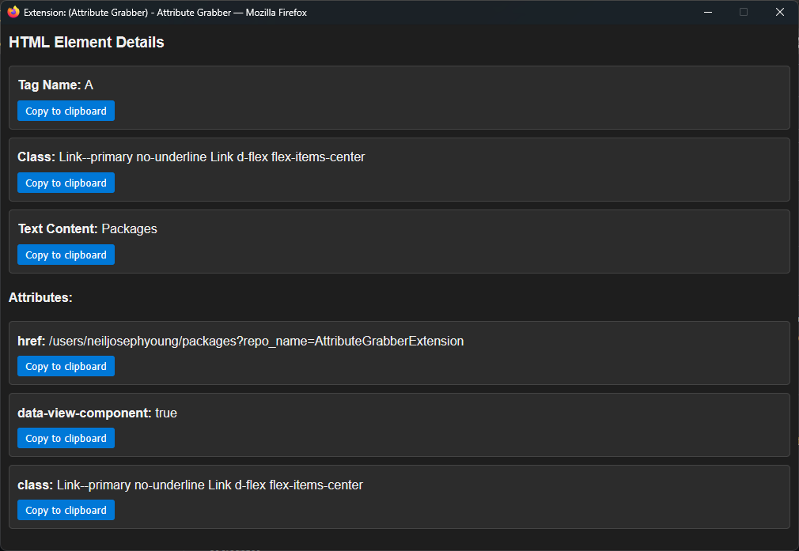

# Attribute Grabber Extension

## Overview
Attribute Grabber is a Firefox browser extension that allows users to grab HTML attributes from elements on a webpage. It provides a context menu item to inspect elements and displays their details in a popup window.

## Features
- **Context Menu Integration**: Right-click on any element to grab its attributes.
- **Popup Window**: Displays element details such as tag name, ID, class, name, type, value, placeholder, text content, and other attributes.
- **Copy to Clipboard**: Easily copy individual attributes using the provided buttons.
- **Dark/Light Mode**: Automatically adjusts the popup styling based on system settings.

## Install
- Paste the following into your firefox address window **about:debugging#/runtime/this-firefox**
- Click Load Temporary Add-on...
- Select manifest.json

## Usage
- Right click on the target element
- Click on the context menu item **Grab html element**
- Popup will display any found attributes 
    
- Most recently scanned element will be stored in the extension popup window